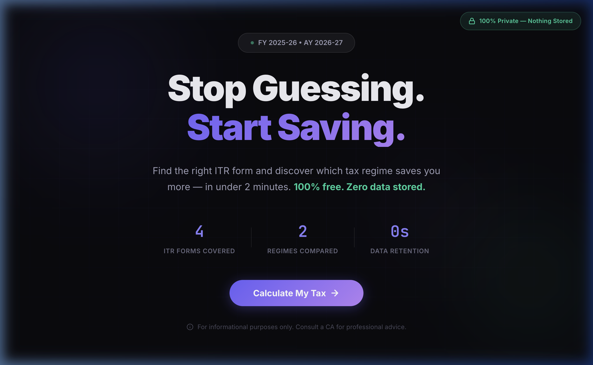
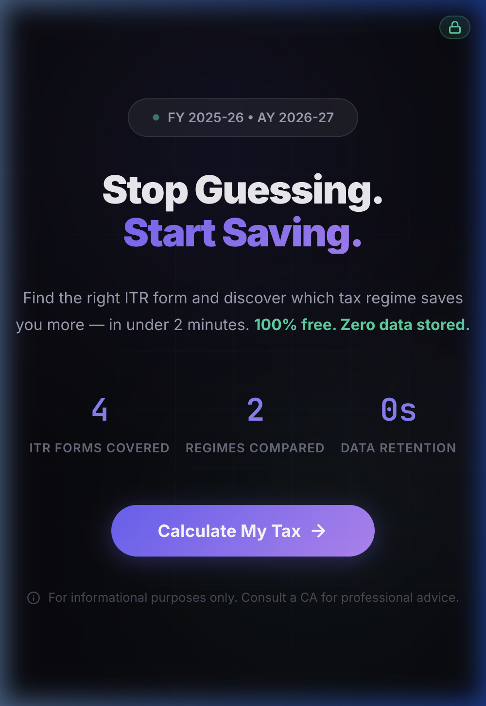

# 🇮🇳 ITR Form Selector & Tax Regime Comparator

Hey everyone! 👋 

If you're anything like me, every year around tax season, you probably find yourself frantically Googling: *"Which ITR form should I fill?"* or *"Is the Old Regime or the New Regime better for me this year?"* Especially with the recent Budget updates (FY 2025-26 / AY 2026-27), the standard deduction and tax slabs changed *again*, leaving a lot of us confused.

I got tired of messy Excel sheets and calculators that asked for my phone number just to show me my tax liability or bombarded me with ads. So, I built this **free, open-source, and 100% private** web tool over the weekend to solve my own problem—and hopefully yours too! 

---

## 📸 See It In Action!

Here's a quick look at what the tool does:


*A seamless, 4-step process to get your tax results in under 2 minutes.*

### The Dashboard Highlights:

<div align="center">
  
  
</div>
<br>
<div align="center">
  
  
</div>

---

## ⚡ Why Use This Tool?

1. **🔒 100% Privacy-First**: I don't want your data, and I don't store it. This entire application runs **locally in your browser**. Once the page loads, you can literally turn off your Wi-Fi, and it will still work perfectly. No backend, no databases, no tracking.
2. **🎯 ITR Form Auto-Selection**: Are you a salaried employee with some freelance income and some stock market trades? The app asks you simple Yes/No questions and tells you exactly which form (ITR-1, 2, 3, or 4) you need so you don't file the wrong one.
3. **⚖️ Old vs. New Regime Comparison**: It calculates your exact tax liability under both the Old Regime and the newly updated New Regime (with the updated ₹75,000 standard deduction) and tells you clearly which one keeps more money in your pocket.
4. **💡 Smart Tax Tips**: Based on your inputs, the engine gives you actionable insights (like maximizing 80C, claiming NPS under 80CCD(1B), or harvesting your LTCG).

---

## 📘 Mini Tax & ITR Guide for FY 2025-26

If you want to understand *how* the app makes its decisions, here's a quick primer:

### 1. Which ITR Form do I need?
*   **ITR-1 (Sahaj)**: For Resident Individuals whose total income is up to ₹50 Lakhs. It covers income from Salary, one house property, and other sources (interest, agriculture up to ₹5k).
*   **ITR-2**: If you have Capital Gains (sold shares/mutual funds, crypto), hold unlisted shares, are a Company Director, or have foreign assets. 
*   **ITR-3**: For individuals with income from a Business or Profession (e.g., freelancers, traders, F&O).
*   **ITR-4 (Sugam)**: For individuals opting for the Presumptive Taxation Scheme under Section 44AD, 44ADA (for professionals), or 44AE.

### 2. Old vs. New Tax Regime: What changed?
The New Regime is now the **default** system. For FY 2025-26, the New Regime looks like this:
*   Standard Deduction for salaried employees increased to **₹75,000** (from ₹50,000).
*   Tax slabs updated (0% up to ₹4L, 5% up to ₹8L, 10% up to ₹12L, etc.).
*   **Rule of Thumb:** If your total deductions (e.g., 80C, 80D, HRA, Home Loan Interest) exceed roughly ₹3.75 Lakhs - ₹4 Lakhs, the Old Regime *might* still be better. Otherwise, the New Regime usually wins. (But always use the calculator to run your specific numbers!)

---

## 🛠️ Technical Details & Industry Standards

I wanted to build something robust, performant, and adhering to strict software engineering standards without over-engineering it. 

### Architecture
*   **Zero-Dependency Frontend**: Written in pure HTML5, modern vanilla CSS3 (CSS Variables, Glassmorphism UI), and vanilla JavaScript (ES6 Modules/IIFE patterns for encapsulation). No React, no NPM madness, no bloated bundle sizes. Instant load times.
*   **Security & Industry Standards**: Configured with strict headers (`netlify.toml`) including a highly restrictive Content-Security-Policy (CSP) that denies external network requests (`connect-src 'none'`) to mathematically guarantee data privacy. 
*   **Progressive Enhancement**: Completely fluid and responsive layout scaling flawlessly across Mobile, Tablet, and Desktop.
*   **Modular Codebase**: Tax computation (`taxEngine.js`), rules logic (`formSelector.js`), and DOM manipulation (`uiController.js`) are strictly separated for easy testing and maintainability when tax laws change.

### Getting Started (Run it Locally)
Because it's a static site, you can just download the folder and double-click `index.html`. Or, if you prefer using a local server for testing:

```bash
# Clone the repository
git clone https://github.com/yourusername/itr-form-selector.git
cd itr-form-selector

# Run a quick local server using Python (No dependencies required)
python3 -m http.server 8080

# Go to http://localhost:8080 in your browser
```

---

## 🤝 Contributing
Found a bug with a specific tax calculation edge case? Have an idea for a new feature? Know of a tax deduction rule I missed? Pull requests are incredibly welcome! Let's make this the standard free tool for everyone.

**Disclaimer:** *I am a developer, not your CA. This tool is built using the latest publicly available Budget rules for educational and informational purposes only. Do not consider this as professional financial advice. Please consult a qualified tax professional before filing.*
